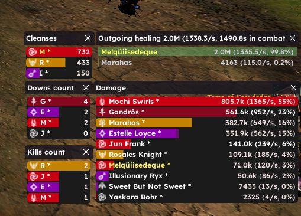
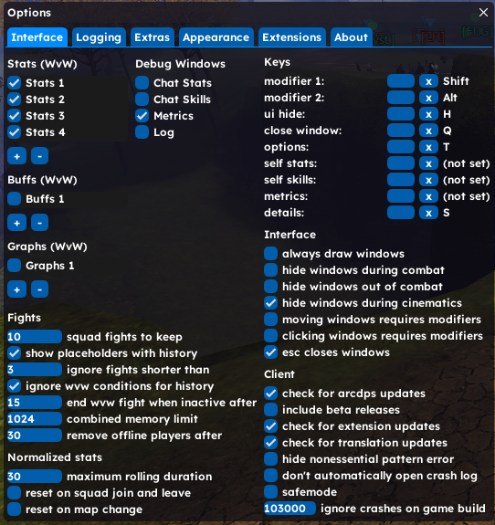

# ArcDPS Config — DPS / Healing / Cleanses / Kill & Down Counter

Personal [ArcDPS](https://www.deltaconnected.com/arcdps/) configuration for **Guild Wars 2**, with a custom UI theme: rounded windows, custom font, and a clean layout for combat tracking.

## Features

- **DPS meter** — real-time and end-of-fight damage breakdown
- **Healing tracking** — via the ArcDPS Healing Stats extension
- **Cleanses tracking** — condition removal count per player
- **Kill count** — enemy kills tracked per fight/session
- **Down count** — times each player goes down
- **Custom font** for better readability in windows/overlays
- **Rounded window corners** and a personalized visual style (no default flat/square ArcDPS look)

## Files in this repo

| File | Purpose |
|---|---|
| `arcdps.ini` | Main ArcDPS settings — window layout, columns shown, colors, style |
| `arcdps_imgui.ini` | Saved window positions/sizes (Dear ImGui state) |
| `arcdps_healing_stats.json` | Config for the Healing Stats extension (outgoing/incoming healing tracking) |
| `arcdps_font.ttf` | Custom font used by the ArcDPS overlay windows |

## Requirements

This repo contains **only configuration files** — you need the actual DLLs installed first:

1. **ArcDPS core** — download `d3d11.dll` from the [official ArcDPS page](https://www.deltaconnected.com/arcdps/) and place it in your GW2 `bin64` folder.
2. **Healing Stats extension** — required for the healing tracking to work (`arcdps_healing_stats.dll`), also available from the ArcDPS page under extensions.
3. A legit Guild Wars 2 install with ArcDPS already launching correctly (test with the default config before applying this one).

> ArcDPS is a well-established, widely used combat meter for GW2 and is explicitly tolerated by ArenaNet (it's not an automation/cheat tool — it only reads combat data). Still, always download the core DLL from the official source above, never from a third-party mirror.

## Installation

1. Locate your Guild Wars 2 ArcDPS folder (usually `...\Guild Wars 2\addons\arcdps\`, or wherever your `d3d11.dll` for ArcDPS lives).
2. Back up your current config files if you already have one you like.
3. Copy all files from this repo directly into that folder — overwrite when prompted.
4. Launch Guild Wars 2. The custom layout, font, and rounded windows should load automatically.

## Notes

- Window positions saved in `arcdps_imgui.ini` are relative to a specific screen resolution — if your resolution differs, you may need to reposition/resize the windows once and re-save.
- Feel free to fork and tweak `arcdps.ini` to adjust colors, opacity, or which stats columns are shown.
