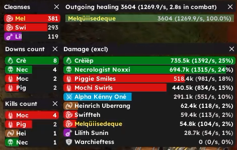
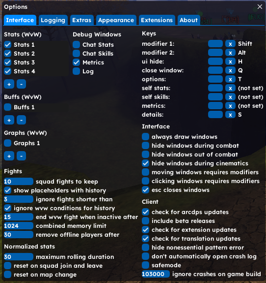

<div align="center">

# ⚔️ My ArcDPS Setup

**A clean, rounded ArcDPS configuration for Guild Wars 2**
DPS · Healing · Cleanses · Kills · Downs


[📸 Preview](#-preview) · [✨ Features](#-features) · [📦 Requirements](#-requirements) · [🚀 Installation](#-installation) · [📝 Notes](#-notes)

</div>

---

## 🎨 Versions

Both versions have the same layout and features. Only the look is different.

| | Version | Folder | Look |
|:-:|---|---|---|
| ⭐ | **v2 · Nexus style** _(current)_ | [`configs/v2-nexus-style`](configs/v2-nexus-style) | Neutral grey theme with 6px rounded corners, taken from the Nexus default UI style |
| 🗂️ | **v1 · Original** | [`configs/v1-original`](configs/v1-original) | The first version of this setup, with 5px rounded corners and its own colour scheme |

## 📸 Preview

### ⭐ v2 · Nexus style

<!-- Drop the screenshot at docs/v2-nexus-style/preview.png and uncomment the line below -->
<!--  -->

> 📷 _Screenshot coming soon._

### 🗂️ v1 · Original



## ✨ Features

| | |
|:-:|---|
| 💥 | **DPS meter**: real-time and end-of-fight damage breakdown |
| 💚 | **Healing**: outgoing and incoming healing via the Healing Stats extension |
| 🧹 | **Cleanses**: condition removal count per player |
| 💀 | **Kill count**: enemy kills per fight and per session |
| 🩸 | **Down count**: how many times each player went down |
| 🔤 | **Custom font** for better readability |
| 🔲 | **Rounded windows** instead of the default square ArcDPS look |

## 📁 What's inside

```
configs/
├── v1-original/
└── v2-nexus-style/
    ├── arcdps.ini                  ⚙️  main settings: columns, colours, UI style
    ├── arcdps_imgui.ini            🪟  window positions and sizes
    ├── arcdps_healing_stats.json   💚  Healing Stats extension settings
    └── arcdps_font.ttf             🔤  font used by the ArcDPS windows
docs/                               🖼️  screenshots
```

Each folder under `configs/` is a complete set, ready to copy.

## 📦 Requirements

This repo has **only configuration files**. Install the addons first:

1. **[ArcDPS](https://www.deltaconnected.com/arcdps/)**, loaded one of two ways:
   - 🔹 **Standalone**: put `d3d11.dll` in the Guild Wars 2 root folder, next to `Gw2-64.exe`.
   - 🔹 **Through [Nexus](https://raidcore.gg/Nexus)**: Nexus takes the `d3d11.dll` slot and loads ArcDPS from `addons/ArcDPS.dll`. Install ArcDPS from the Nexus addon library.
2. **[Healing Stats](https://github.com/Krappa322/arcdps_healing_stats/releases)**, needed for the healing columns.

> [!CAUTION]
> Only download DLLs from the official sources above, never from mirrors.

## 🚀 Installation

1. ❌ **Close Guild Wars 2.**
2. 💾 **Back up** your current files in `Guild Wars 2\addons\arcdps\`.
3. 📋 **Copy** everything from **one** folder (`configs/v2-nexus-style` or `configs/v1-original`) into `Guild Wars 2\addons\arcdps\` and replace the existing files.
4. ▶️ **Launch** the game.

> [!WARNING]
> ArcDPS saves its config when the game closes. If you copy the files with the game open, your changes will be overwritten.

## 📝 Notes

<details>
<summary>🖥️ <b>Different screen resolution?</b></summary>
<br>

Window positions in `arcdps_imgui.ini` were saved at a specific resolution. If yours is different, move and resize the windows once. ArcDPS saves the new positions on exit.

</details>

<details>
<summary>🎨 <b>Where the theme lives</b></summary>
<br>

The whole UI style is stored in four lines of `arcdps.ini`:

```ini
appearance_imgui_style180=...
appearance_imgui_colours180=...
appearance_imgui_style192=...
appearance_imgui_colours192=...
```

They are base64 dumps of Dear ImGui's style struct. Current ArcDPS uses the `192` keys (ImGui 1.92). The `180` keys are kept for older builds and for Nexus's _"ArcDPS Current"_ style import.

To switch theme while keeping everything else, copy only these four lines from one version to the other.

</details>

<details>
<summary>🛠️ <b>Changing the style in-game</b></summary>
<br>

Open the ArcDPS options (`Alt` + `Shift` + `T`) and edit the style there. Changes are written back to `arcdps.ini` when you close the game.

</details>

---

<div align="center">
<sub>Made for personal use. Feel free to fork and tweak it. 🛡️</sub>
</div>
